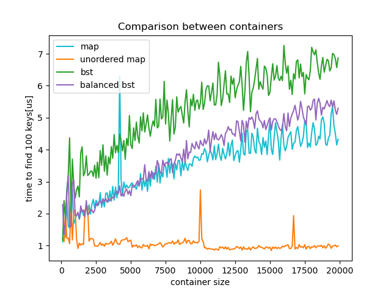
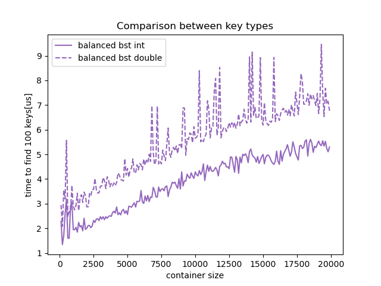

# Binary Search Tree

The project consists in the implementation of a Binary Search Tree (BST), using the C++ programming language. A BST is a data structure used to store data in an organized way, which also allows to quickly retrieve them.  Generally it is made of nodes, each storing a pair: a *key* and a *value*. A BST is ordered hierarchically so that every node is connected to at most two other below, called children: the *left* and *right* children. Data are stored based on the comparison between keys: given a current observed node and a new one to insert, if the key of the latter is smaller than the one of former, the new datum is going to populate the left subtree of the current node, and the right subtree otherwise.

The Binary Search Tree has been implemented in the form of a template class, whose templates are the key type `K`, the value type `V` and the comparison operator type `CO` (set, by default, to ``` std::less<K> ```).  The `bst` class contains two nested classes, the `node` struct and the `_iterator` class, in order to meet the variety of needs associated with this kind of data structure.

Finally, the implemented BST has been benchmarked, comparing its performance to those of some STL data structures, like the ordered and the unordered maps.

## Nested classes

#### Struct `node`

```node``` is a struct implemented to mimic the features of a Binary Search Tree node. 

Indeed, this struct has four members:

- ``data`` , a `std::pair<const K, V>` object, which stores the key and the value corresponding to a given node;
- `left` and `right`, that are the left and right children of a given node. Since each node can have at most one left child and one right child it seemed suitable for them to be `std::unique_ptr<node>`.
- `parent`, which is a raw pointer `node*` to the parent node of a give node. It was chosen to be a raw pointer instead of a unique pointer to a node because a node can have two children, each pointing to the same parent node.

As part of this class there are also the default node constructor and destructor and a couple more custom constructors: one that construct a node from a given pair of key and value, and the other that takes also a raw pointer to a node, which will become the new parent of the constructed node.

Finally, three member functions were added:

- `node* findLowest()noexcept`:  function built to find the leftmost node belonging to the subtree which has the current node as the root. This function is of utmost importance in the development of the class `_iterator`.
- `node* findUpper()const`:  function built to find the first right ancestor of a given node, that is a previously inserted node with the first key larger than the given one. Also `findUpper()` holds a very important role in the implementations of the `_iterator` class.
- `unsigned int depth(unsigned int&& Depth=1)`: recursive function needed to compute the depth of a node in the tree.

`node` was build as a nested class inside the private section of the larger `bst<K, V, CO>`: this choice seemed the most suitable since the BST node is a structure that should not be created nor accessed by the user at any time. There are ways to insert a node into the tree, but there should be no reason to create a BST node without creating a Binary Search Tree, or to access and change some of its important members, such as `left` and `write`.    

#### Class `_iterator`

`_iterator<oK, oV>` is a template class, needed to iterate through the a `bst<K, V, CO>` object.  In order to perform all the requested tasks, it was sufficient to implement a *forward* iterator.

`_iterator` contains a private member `here`, which is a pointer to a node. In the public section, a part from the obvious default constructor and destructor, one can find a custom constructor, for constructing an iterator with a pointer to a node, and the overloading of  the pre- and post-increment operators (`++`), for which the definition of the aforementioned `findLowest()` and `findUpper()` is fundamental, the equality and inequality comparison operators (`==`, `!=`), the dereference operator (`*`) and the arrow operator (`->`).

As for the node struct, the iterator class was implemented as a nested class inside the BST template class, since `_iterator<oK, oV>` depends on the structure of the Binary Search Tree itself.


## `bst` template class

The private section of the class `bst<K, V, CO>`  contains the struct `node`, the member `root`, and some member functions that should not be accessible to the user.

#### Root

The private member `root` is used to identify the root node of the tree in a unique way. Since every tree has only one root, it was defined as unique pointer to a node.

## Member functions

#### insert

```c++
//private
    template<class N>
    std::pair<typename bst<K, V, CO>::iterator, bool> _insert(N&& x);
//public
    std::pair<iterator, bool> insert(const pair_type& x);
    std::pair<iterator, bool> insert(pair_type&& x);
```

This functions are called when the user wants to insert a new node inside the BST. They take as input respectively an lvalue or an rvalue of a pair key/stored-value, and return an iterator pointing to the node, and a boolean stating the success of the insertion, using the helper function `_insert`.

**Helper function `_insert`**: If the BST is empty this function insert the node as the root of the tree. Otherwise, it navigate through the tree until it finds a suitable parent node for the given one. It then compares the key given with the one of the found parent, and set the new node as a *left* or *right* child consequently. The pair key-double is passed to the constructor using `std::forward` to avoid code duplication as it passes variables as lvalue if we use the first `insert` function and as rvalue if we use the second. If during this process the function finds a node with the same key, it returns an iterator pointing to that node, paired with a *false* boolean. 

####  begin

```c++
//public
	iterator begin() noexcept;
    const_iterator cbegin() const noexcept;
```

 This function is used to start iterations on the tree. It returns an iterator to the leftmost node, the one with the smallest key. 

#### end

```c++
//public
	iterator end() noexcept;
    const_iterator end() const noexcept;
```

This function is used to finish an iteration on the tree. It returns an iterator pointing to one past the last element of the tree.

#### clear

```c++
//public
void clear();
```

This function deletes the tree by resetting the `root`.

#### erase

```c++
//private 
    void transplant(const key_type& x,const key_type& y);
    void new_child(const key_type& x,const key_type& y,bool side);
    void erase_node(node* N);
//public
	void erase(const key_type &key);
```

This function is called when the user wants to erase a node. It takes as input the key of the node we want to delete. If there isn't any node with that key in the tree, or the tree is empty, a warning message is printed on the screen. Otherwise, the function handle differently every situation which can arise in the erase process:

1. The node has **0 children** and **is the root**: the function clear the three.
2. The node has **0 children** and **is not the root**: the function determine if the node is a left or right child through the use of the helper function `child_side` , reset its parent corresponding left or right pointer to `nullprt` and erase the node through the use of the helper `erase_node`.
3. The node has **1 children**: the function substitute the node with its children through the use of the helper function `transplant`.
4. The node has **2 children**: the function find the node with the smaller key on the right subtree of the node and substitute it to the node itself, and erase the node with the helper `erase_node`. In this case, all different situations are handled depending whether the node to erase is the root or not, and whether the substitute node is the child of the one to erase.

**Helper functions**:

**`transplant`**: It takes as input the keys of two nodes, a parent and a child. It gets the pointers to such nodes, check if the parent is root, and in such case reset the root to the child node, and the child node's parent pointer to `nullprt`. Otherwise, it gets the side of the child (left or right) and thanks to the helper function `new_child` it set the child as the child of the parent's parent, and the child's parent as the parent's parent. It than erase parent node with the helper `erase_node`.

**`new_child`**: It takes as input the keys of two nodes, a parent and a child, and boolean representing the side to set the child to (false for left, true for right). In then handles the pointers of the two nodes in order to create parent-child relation between the two on the indicated side.

**`erase_node`**: It takes a node as input, it reset to `nullptr` its *left*, *right* and *parent* pointers, and delete the data.

#### balance

```c++
//private
	void newbalancedtree(std::vector<pair_type>& v, int first, int last);
//public
	void balance();
```

This function is called when the user wants to balance the tree. It stores in an orderly fashion all the node pairs contained in the tree in vector,  it deletes the old tree using the function `clear`, and reconstructs it in a balanced way with the helper function `newbalancedtree`.

**Helper function `newbalancedtree`**: this function takes as input an ordered vector of pair, and two int represent the index of the first and last element of the vector on which the function works.  It computes the median value of the vector considered , and it inserts it in the new tree (with the function `insert`), recalling itself recursively on the two remaining halves of the vector.

#### child_side

```c++
//public
	bool child_side(const key_type &x);
```

This function takes as input a key of a node, and return a boolean: *false* if the node is a left node, *true* if it is a right node. It achieves so comparing the node pointer with the left and right node pointer of its parent node. 

#### find

```c++
//public
	iterator find(const key_type& x);
	const_iterator find(const key_type& x) const;
```

This functions are called when the user wants to find a node in the BST with a given key. Of the two functions, the first returns an iterator which points to the node that have the given key, the latter returns a const iterator which also points to the given key. The functions follow the hierarchy of the keys, checking every node, until a match is found. If that key is not found, or the tree is empty, both functions will return `end()` or `cend()` respectively.

#### Copy semantic

```c++
//private
	void clone(const std::unique_ptr<node>& node_to_copy);
//public    
	bst(const bst& to_copy) { clone(to_copy.root); }
	bst& operator=(const bst& to_copy);
```

Copy semantics is implemented as a copy constructor and the overload of the operator `=`. It is used to make a deep copy of a binary search tree, with the help of the private function `clone`, which recursively copies all the subtrees of a binary search tree given its root.

#### Move semantic

```c++
//public
	bst(bst&& move_from): root(std::move(move_from.root)) {}
	bst& operator=(bst&& move_from);
```

Move semantics is implemented as a move constructor and the overload of the operator `=`. It is used to move the elements of a binary search tree into another tree, without copying them.

#### emplace

```c++
//public
	template<class... Types>
    std::pair<iterator,bool> emplace(Types&&... args);
```

This function is called when the user wants to insert a new element into the container constructed in-place.  It returns a pair of an iterator pointing to the inserted node and a bool which is `true` if a new node has been allocated, `false` if the node is already in the tree. It uses a template so that the user can simply pass two values to this function.

#### Subscripting operator

```c++
//public
	reference operator[](const key_type& x);
    reference operator[](key_type&& x);
```

This operator searches for the key given in input. If such key is present in the tree, it returns the value correspondent to that key, if it is not, it inserts the pair made by the given key and a default constructed value using the function `insert`. This operator has been overloaded twice, covering both the cases in which an lvalue or an rvalue is passed to the function.

#### Put-to operator

```c++
//public
	friend
    std::ostream &operator<<(std::ostream &os, const bst &x)
```

This function implement the overload of the put-to operator, which lets the user print the tree in ascending order of the keys.

#### print_bst

```c++
// private
	key_type key(typename bst<K, V, CO>::const_iterator it) const noexcept;
//public
	friend void print_bst(const bst& x, std::ostream& os=std::cout);
```

This function is used to print the structure of the tree on a two-dimensional plane.  In order to keep the implementation as simple as possible, the tree is not printed downward, with the root at the top and the deeper nodes at the bottom, but from left to right, with the root as the first node to the left, while left children grow upward and right ones downward.

For example, consider the following tree

```c++
std::pair<int, int> pair_0=std::make_pair(4, 2);
std::pair<int, int> pair_1=std::make_pair(10, 7);
std::pair<int, int> pair_2=std::make_pair(-1, 1);
std::pair<int, int> pair_3=std::make_pair(0, 1);
std::pair<int, int> pair_4=std::make_pair(-3, 25);
std::pair<int, int> pair_5=std::make_pair(6, 12);
std::pair<int, int> pair_6=std::make_pair(11, 0);

bst<int,int> binary_tree{};

(void)binary_tree.insert(pair_0);
(void)binary_tree.insert(pair_1);
(void)binary_tree.insert(pair_2);
(void)binary_tree.insert(pair_3);
(void)binary_tree.insert(pair_4);
(void)binary_tree.insert(pair_5);
(void)binary_tree.insert(pair_6);
```

the result obtained with `print_bst(binary_tree_0);` becomes:

```bash
                         (-3,25)

               (-1,1)

                         (0,1)

(4,2)

                         (6,12)

               (10,7)

                         (11,0)
```

The tree is still printed according to the key comparison criterion (from the smallest to the larger key), but also taking account the node depth by means of whitespaces. 

**Helper function `key`**: This function is needed in order to retrieve the key of the pointed node when requested as arguments of the function `node_depth()` used inside the function `print_bst().

#### node_depth

```c++
//public
    unsigned int node_depth(const key_type& k);
```

This function is called when the user wants to know the depth of a given node. It returns an int representing the number of ancestors the given node has in the tree. It does so using the helper function `depth` defined in node.

#### max_depth

```c++
//public
	unsigned int max_depth();
```

This function is called when the user wants to know the depth of the tree. It returns an int representing the number ancestors of the node that is the most distant from the root. It does so by checking the distance from the root of all nodes, using the helper function `depth` defined in the node, and finding its maximum.

#### follow_key_order

```c++
// private
node* follow_key_order(const key_type& key, node* N);
```

Since various functions (`_insert()`, `find()`, `find() const`) uses the same lines of code in order to find the proper child of the current node on which to move given a `key`, it seemed more convenient to build a single function for this purpose, so that code duplication can be avoided.

## Benchmark

We compared the performance of our binary search tree to the c++ standard library functions `std::map` and `std::unordered_map` with integer key and value, the performance metric we used is the time to find 100 randomly drawn keys. We expect that `std::map` will show a logarithmic time complexity in the size of the container $N O(\log_2 (N))$ while for `std::unordered_map` the time complexity is constant $O(1)$. For the unbalanced BST we expect $O(\log_2 (N))$ on average but $O(N)$ in the worst case (the tree is a linked list), finally for the balanced version of the BST we will always have a time complexity of $O(\log_2 (N))$. The following graph shows the time to find 100 keys averaged over 10 measurements with increasing size of the container, the data is obtained by running the code `benchmark.cc` compiled with -O3 optimization



The results are consistent with our expectations, the unordered map shows an approximately constant behavior and is the fastest container, while the other containers show a logarithmic behavior, with the balanced BST faster than the unbalanced one.

We also compared double key types with int key types, we expect that the tree with double keys will take longer to find the same amount of keys and this is confirmed from the graph below.




To produce the same graphs on your machine you can run the `test.sh` script found in the benchmarks folder. The script will compile the `benchmark.cc` code with -O3 optimization, run it and will execute the python script `analisys.py` which will produce the graphs.

# Reverse dictionary

The purpose of the exercise is to find the reverse of a python *dictionary*: given the keys and the values of a dictionary `d`, a new dictionary `rd` must be created in such a way that the values become the new keys, and the keys the values. This is done by a function, called `reverse_dict()`.

#### Reverse_dict

```python
def reverse_dict(d):
    new_keys = set([item for sublist in list(d.values()) for item in sublist])
    return {k: [item[0] for item in list(d.items()) if item[1].count(k) >= 1] for k in new_keys}
```

The use of list comprehensions helped  to make the code as efficient and short as possible. A first one was exploited to extract the new keys from the original dictionary: the list of the extracted values (that is, the new keys) contains all the elements of all the values of the original dictionary, thus many repetitions probably occur in it. To avoid them, a set of all the new keys is created out of the aforementioned extracted list, using the `set()` function. The function then returns a dictionary: the keys are taken from the previously created set and the values are lists made of those keys of the original dictionary whose associated values contained the new key at least once.

